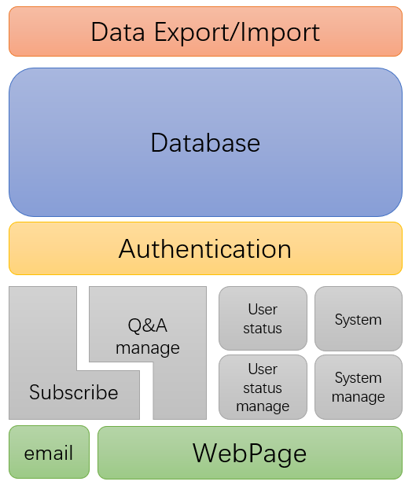

# 需求文档

## 功能

### 总览

该项目为课程论坛，旨在为学院内各课程提供一个讨论区，记录并保存有价值的问题和回答。

从使用功能上看，可以划分为如下几个部分：

- Q&A：在课程中发起提问、回答问题。
- 订阅：关注具体的课程或问题，通过邮件的方式接收提问（回复）并参与讨论。
- 课程管理：教师创建课程、设置课程基本信息及状态。
- 个人信息系统：展示个人信息、等级，以及教师的所有课程，学生的所有回答。
- 论坛管理：对论坛进行管理维护，分配权限。

从设计角度看，可以划分为如下几个部分：

- 数据库：保存各种信息及数据。
- 动态页面生成：与用户的直接接口。
- 认证系统：登录状态认证、权限认证。
- Q&A管理：维护各问题及回答的状态。
- 用户状态管理：维护用户的状态信息。
- 订阅系统：与用户的第二接口。
- 系统管理：对系统运行状态进行管理。
- 数据导入导出。

大体关系如下所示：

### Q&A管理

- 从数据库中读取给定课程的所有问题及其基本信息。
    该接口对 **WebPage** 开放。对应课程的 Q&A 页面问题列表。
    问题类型包括：
    1. 问题（需要回答）
    2. 笔记（不需要回答，但可以评论）

    问题应被类似如下分割标签分割：
    1. pinned
    2. 今天的
    3. 一个星期的
    4. 更久远的

    问题的基本信息应包括：
    1. 标题
    2. 发布时间
    3. 类型
    4. 回复数
    5. 一些特殊的标签
        - 教师发布
        - 好问题
        - 教师回答
        - 。。。
    6. optional：前n个字的内容

- 从数据库中读取给定问题的详细信息及所有回答的详细信息。
    该接口对 **WebPage** 开放。对应点击具体的问题显示的内容。
    问题的详细信息应包括如下信息：
    1. 问题类型
    2. 浏览数
    3. 问题标题
    4. 问题正文
    5. 问题标签
    6. 收藏按钮
    7. 编辑按钮
    8. “good question”投票
    9. 最近更新时间

    回答的详信息应包括如下内容：
    1. 回答者
    2. 回答时间
    3. 回答标题
    4. 回答正文
    5. 最近更新时间
    6. optional：对回答的评论（包括评论按钮、评论列表）

- 对每一个问题，维护其编辑历史。
    该接口对 **WebPage** 开放。对应点击编辑问题按钮显示的内容。
    包括每个版本的变化。

- 支持用户在线编辑问题，提供（实时）渲染。
    该功能对 **WebPage** 开放。对应新建问题或新增回答时的编辑框。
    渲染可采用实时渲染或按按钮展示渲染后的效果的方式。

- 向数据库中写入新的问题、或问题下新的回答。
    该接口对 **WebPage** 及 **Email** 开放。对应通过网页或邮件发起问题、回答问题。
    在设计时应做到对二者服务的统一性。

- 对于每个问题，维护其浏览次数、“好问题”等信息。
    该功能对 **WebPage** 开放。对应问题的一些特殊信息。

- 上传图片至图床，并返回有效的链接。
    该接口对 **WebPage** 开放。对应在网页端编辑页面的“添加图片”功能。

- 从数据库中删除问题。
    该接口对 **WebPage** 开放。仅管理员拥有相关权限。

- 从数据库中删除回答或笔记。
    该接口对 **WebPage** 开放。管理员、回答或笔记的所有者拥有相关权限。

### 认证系统

- 提供用户登录、注册、找回密码、注销账号等一般功能。
    这部分功能对 **User status management** 开放。
    另有具体的子接口，暂时不再列出。考虑使用现有的库实现。

- 向用户发放token。
    该接口对 **User status management** 开放。登录成功后向用户发放含有有效期的token。
    通过维护一个token列表实现。考虑使用现有的库。

- 检查token是否有效，有效则返回uid。
    该接口对 **所有后端模块** 开放。检查用户提供的token是否有效。
    通过查找token列表实现。

- 根据token判断用户类型。
    该接口对 **所有后端模块** 开放。
    用户类型包括：
    1. 管理员
    2. 老师
    3. 学生
    4. 游客
    
    通过查找token及用户列表实现。

- 根据邮箱返回用户uid。
    该接口对 **Subscribe** 开放。用来认证邮件对应的用户。

##　参考的第三方库
- email模块
    https://james.apache.org/

- 认证模块
    https://github.com/Yubico/java-webauthn-server
    https://gitee.com/yadong.zhang/JustAuth
    https://github.com/fujieid/jap
    